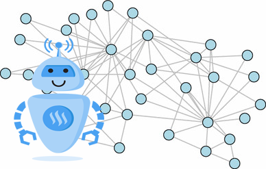
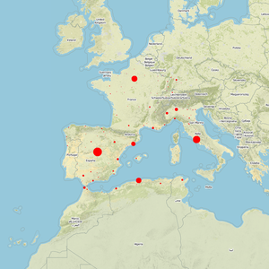
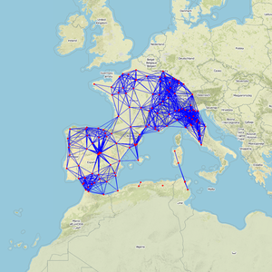
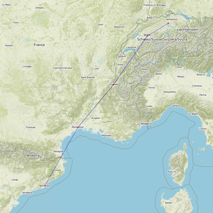

> ESBORRANY! NO UTILITZEU!!!

# GraphBot

El projecte GraphBot per GEI-LP (edició 2019)

## Introducció

Aquesta pàgina descriu el projecte GraphBot, que correspon a la pràctica de
Python pel curs de primavera 2019 de LP al GEI. La vostra tasca consisteix en
implementar un Bot de Telegram que constesti textualment i gràficament
preguntes relacionades amb grafs geomètrics definits sobre les ciutats de tota
la Terra.

Aquí en teniu una petita demostració: (FAKE!!!)

## Grafs geomètrics

Un conjunt de punts en un espai i una distància *d* defineixen un graf geomètric
que té com a vèrtexs els punts i, com arestes, aquells parells de punts que es
troben a distància `<= d`.

## Dades

Trobareu les dades amb les ciutats de la Terra al fitxer
[dades/worldcitiespop.csv.gz](dades/worldcitiespop.csv.gz).
Aquestes dades provenen de [MaxMind](https://www.maxmind.com/) i estan
subjectes en aquesta [llicència](dades/LICENSE.txt).

## Comandes del Bot

El vostre Bot ha d'entendre i contestar correctament les comandes següents:

### `/start`

Inicia la conversa amb el Bot.

### `/help`

El Bot ha de contestar amb una llista de totes les possibles comandes.

### `/author`

El Bot ha d'escriure el nom de l'autor del projecte i seu
correu electrònic oficial.

### `/graph ⟨distance⟩ ⟨population⟩`

Indica al bot que, a partir d'aquest moment, utilitzi un nou graf.

Per fer-ho, cal que descarregui les dades de
[dades/worldcitiespop.csv.gz](dades/worldcitiespop.csv.gz) i construeixi el
graf geomètric amb distància `⟨distance⟩` (en quilòmetres) i restringint-se a
poblacions amb `⟨population⟩` habitants o més (ignoreu les poblacions sense
informació de la seva població).

Heu de crear el graf geomètric eficientment (uns pocs segons com a molt). Per
tant, us caldrà alguna estructura de dades i/o un algorisme que heu d'implementar
vosatres mateixos.

**Nota:** Totes les comandes següents usen el darrer graf generat amb aquesta
comanda. El graf inicial té distància 300 i població 100000.

### `/nodes`

Escriu el nombre de nodes en el graf.

### `/edges`

Escriu el nombre d'arestes en el graf.

### `/components`

Escriu el nombre de components connexs en el graf.

### `/plotpop ⟨dist⟩ [⟨lat⟩ ⟨lon⟩]`

Mostra una mapa amb totes les ciutats del graf a distància menor o igual que
`⟨dist⟩` de `⟨lat⟩,⟨lon⟩`. Les coordenades són opcionals: si no es dónen, es
refereixen a la posició de l'usuari (aquest l'ha enviar prèviament). El format
de les coordenades és el mateix que al fitxer de dades. Cada ciutat es mostra
amb un cercle, de radi proporcional a la seva població.

Per exemple:

### `/plotgraph ⟨dist⟩ [⟨lat⟩ ⟨lon⟩]`

Mostra una mapa amb totes les ciutats del graf
a distància menor o igual que `⟨dist⟩` de `⟨lat⟩,⟨lon⟩`
i les arestes que es connecten.
Les coordenades són opcionals: si no es dónen, es refereixen a la posició
de l'usuari.

Per exemple:

### `/route ⟨src⟩ ⟨dst⟩`

Mostra una mapa amb
les arestes del camí més curt per anar entre dues ciutats
`⟨src⟩` i `⟨dst⟩`.

La sintàxi de les ciutats és `"Nom, codi_país"`.  En cas de múltiples
ocurrències, trieu-ne una d'arbitrària. Podeu utilitzar la distància de
Lavenstein per cercar de forma més robusta en presència d'errors ortogràfics.

Per exemple, aquesta podria ser la
sortida de `/route "Barcelona, es" "Zürich, ch"`:

### Altres comandes

Si ho voleu, podeu definir comandes addicionals que facin el
vostre projecte més ric i interessant a nivell tècnic i algorísmic.
Documenteu-les adequadament.

### Errors

Tracteu els errors de la manera més raonable possible.
En particular, el vostre programa no s'hauria d'espatllar per peticions
incorrectes dels usuaris.

## Arquitectura

És la vostra responsabilitat escollir l'arquitectura més raonable pel
sistema, tenint en compte que les funcions de tractament de dades i les
funcions del Bot de Telegram han d'estar clarament diferenciades.

## Llibreries

Utilitzeu les llibreries de Python següents:

- `networkx` per a manipular grafs.
- `haversine` per calcular distàncies entre coordenades.
- `FuzzyWuzzy` per calcular semblances entre textos.
- `staticmap` per pintar mapes.
- `requests` per baixar fitxers.
- `python-telegram-bot` per interactuar amb Telegram.

Podeu utilitzar lliurament altres llibreries estàndards de Python, però si no
són estàndards, heu de demanar permís als vostres professors (que segurament
no us el donaran).

## Fonts d'informació

Aquests enllaços us seran útils per fer el vostre projecte:

- [Lliçons de bots de Telegram](https://lliçons.jutge.org/python/telegram.html)

- [Lliçons de fitxers en Python](https://lliçons.jutge.org/python/fitxers-i-formats.html)

- [Tutorial de NetworkX](https://networkx.github.io/documentation/stable/tutorial.html)

## Lliurament

Heu de lliurar la vostra pràctica per correu electrònic al Racó.
Només heu de lliurar un fitxer ZIP que, al descomprimir-se
generi uns fitxers `*.py`, un fitxer `requirements.txt` i un
fitxer `README.md`. Res més. Sense directoris.

Els vostres fitxers de codi en Python han de seguir
[les regles d'estíl PEP8](https://www.python.org/dev/peps/pep-0008/). Podeu
utilitzar el paquet `pep8` o http://pep8online.com/ per assegurar-vos
que seguiu aquestes regles d'estíl.
L'ús de tabuladors en el codi queda
prohibit (zero directe).

El projecte ha de contenir un fitxer `README.md`
que el documenti. Vegeu, per exemple, https://gist.github.com/PurpleBooth/109311bb0361f32d87a2.

El projecte també ha de contenir un fitxer `requirements.txt`
amb les llibreries que utilitza el vostre projecte.
Vegeu, per exemple, https://pip.pypa.io/en/stable/user_guide/#requirements-files.

El termini de lliurament és el XXXXXX.

## Consells

La part del bot de Telegram és divertida, però deixeu-la pel final.

Per evitar problemes de còpies,
no pengeu el vostre projecte en repositoris públics. Si us cal un repositori
GIT, useu [GITLAB FIB](https://gitlab.fib.upc.edu/users/sign_in).

